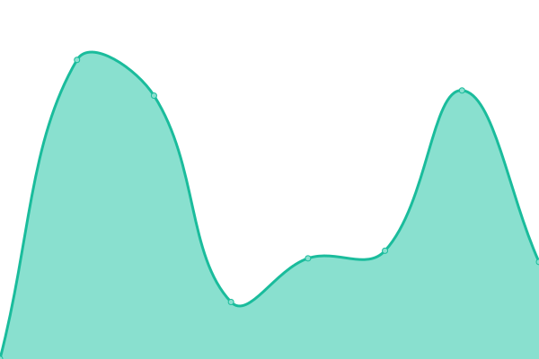

# [📈 Live Status](https://sotoplatero.github.io/upp): <!--live status--> **🟩 All systems operational**

This repository contains the open-source uptime monitor and status page for [Damian Soto](https://dsoto.dev), powered by [Upptime](https://github.com/upptime/upptime).

With [Upptime](https://upptime.js.org), you can get your own unlimited and free uptime monitor and status page, powered entirely by a GitHub repository. We use [Issues](https://github.com/sotoplatero/upp/issues) as incident reports, [Actions](https://github.com/sotoplatero/upp/actions) as uptime monitors, and [Pages](https://sotoplatero.github.io/upp) for the status page.

<!--start: status pages-->
<!-- This summary is generated by Upptime (https://github.com/upptime/upptime) -->
<!-- Do not edit this manually, your changes will be overwritten -->
<!-- prettier-ignore -->
| URL | Status | History | Response Time | Uptime |
| --- | ------ | ------- | ------------- | ------ |
|  [Erik Martel](erikmartel.com) | 🟩 Up | [erik-martel.yml](https://github.com/sotoplatero/upp/commits/HEAD/history/erik-martel.yml) | 

 376ms
     
 | 

<a href="https://sotoplatero.github.io/upp/history/erik-martel">100.00%</a>
    

|  [2200 Brickell](2200brickell.com) | 🟩 Up | [2200-brickell.yml](https://github.com/sotoplatero/upp/commits/HEAD/history/2200-brickell.yml) | 

 435ms
     
 | 

<a href="https://sotoplatero.github.io/upp/history/2200-brickell">100.00%</a>
    

|  [Loudlive](loudlive.com) | 🟩 Up | [loudlive.yml](https://github.com/sotoplatero/upp/commits/HEAD/history/loudlive.yml) | 

 817ms
     
 | 

<a href="https://sotoplatero.github.io/upp/history/loudlive">100.00%</a>
    

<!--end: status pages-->

[**Visit our status website →**](https://sotoplatero.github.io/upp)

## 📄 License

- Powered by: [Upptime](https://github.com/upptime/upptime)
- Code: [MIT](./LICENSE) © [Damian Soto](https://dsoto.dev)
- Data in the `./history` directory: [Open Database License](https://opendatacommons.org/licenses/odbl/1-0/)
